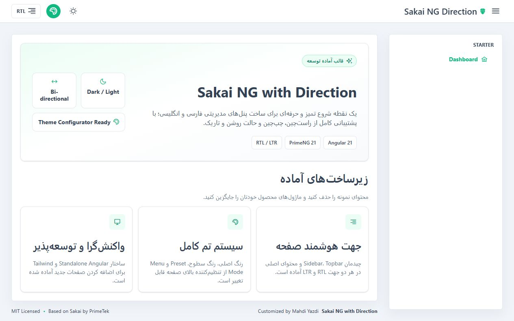

# Sakai NG with Direction

An Angular 21 admin template based on [Sakai](https://github.com/primefaces/sakai-ng) and PrimeNG, enhanced with complete runtime **RTL and LTR direction support**.

This project preserves the familiar Sakai experience while fixing the layout details that usually break when an application switches to a right-to-left interface: sidebar placement, content offsets, menu indentation, icon spacing, mobile navigation, overlay transitions, topbar alignment, and responsive behavior.

It is designed for developers building multilingual or RTL-first dashboards for **Arabic, Persian (Farsi), Hebrew, Urdu, Kurdish, Pashto, Sindhi, Uyghur**, and any other locale that requires a reliable right-to-left interface.


## Preview



## Why this repository exists

Sakai is a strong starting point for Angular admin applications, but converting a full dashboard layout to RTL involves much more than setting `dir="rtl"` on the document.

A dependable bidirectional layout must also handle:

- Sidebar anchoring and slide animations in both directions
- Main-content margins for static and overlay menu modes
- Nested menu indentation and submenu indicators
- Topbar actions, popovers, and mobile menus
- Icon and label spacing
- Responsive navigation behavior
- Consistent borders, surfaces, and contrast in light and dark themes

This repository packages those fixes into a clean starter so you can begin with application features instead of repeatedly debugging direction-related layout issues.

## Features

- Runtime switching between RTL and LTR
- Correct desktop and mobile sidebar behavior in both directions
- Light and dark mode with clear surface separation
- Aura, Lara, and Nora PrimeNG theme presets
- Configurable primary and surface colors
- Static and overlay menu modes
- Angular standalone-component architecture
- Tailwind CSS 4 and PrimeNG utility integration
- Responsive layout for desktop, tablet, and mobile
- Clean starter dashboard without product-specific modules or mock business data
- Vercel-compatible SPA rewrite configuration

## Direction support

Direction state is managed centrally in `src/app/services/language.service.ts`. Switching direction updates:

- The document `dir` attribute
- The document language metadata
- The `app-rtl` and `app-ltr` root classes
- Body direction
- Direction-aware layout styles from `src/rtl.scss`

The topbar control displays the **current direction** with the correct alignment icon. It is a layout-direction control—not a language selector—so it can be connected to any localization solution you prefer.

## Getting started

### Requirements

- Node.js compatible with Angular 21
- npm

### Installation

```bash
git clone https://github.com/mahdiyazdi83/sakai-ng-with-direction.git
cd sakai-ng-with-direction
npm install
npm start
```

Open [http://localhost:4200](http://localhost:4200).

### Production build

```bash
npm run build
```

The production bundle is generated in `dist/sakai-ng-with-direction`.

## Project structure

```text
src/
|-- app/
|   |-- layout/                 # Topbar, sidebar, menu, footer and configurator
|   |-- pages/dashboard/        # Starter dashboard
|   `-- services/
|       |-- language.service.ts # Runtime RTL/LTR state
|       `-- layout.service.ts   # Theme and menu state
|-- assets/
|   `-- layout/                 # Sakai layout styles and theme variables
|-- rtl.scss                    # Direction-aware layout overrides
|-- app.routes.ts               # Application routes
`-- index.html                  # Application entry document
```

## Adding your application

1. Create feature pages under `src/app/pages`.
2. Register routes in `src/app.routes.ts`.
3. Add navigation items in `src/app/layout/menu/menu.ts`.
4. Replace the starter dashboard with your own modules.
5. Connect the direction state to your preferred i18n library if the app is multilingual.

## Theme customization

The topbar configurator supports:

- Aura, Lara, and Nora presets
- Primary-color selection
- Surface-palette selection
- Static and overlay navigation modes

Dark/light state is managed by `src/app/services/layout.service.ts` and uses PrimeNG's `.app-dark` selector.

## Attribution

This project is based on the Sakai Angular template created by **PrimeTek** and distributed under the MIT License. The original license is preserved in [LICENSE.md](LICENSE.md).

RTL/LTR support, layout corrections, visual refinements, cleanup, and starter customization were completed by **[Mahdi Yazdi](https://github.com/mahdiyazdi83)**.

## Contributing

Issues and pull requests are welcome. If you find a direction-specific layout problem, please include the viewport size, active direction, menu mode, and theme in your report.

If this starter saves you time, consider starring the repository—it helps other Angular developers discover the project.

## License

MIT License. See [LICENSE.md](LICENSE.md) for the complete license text.
